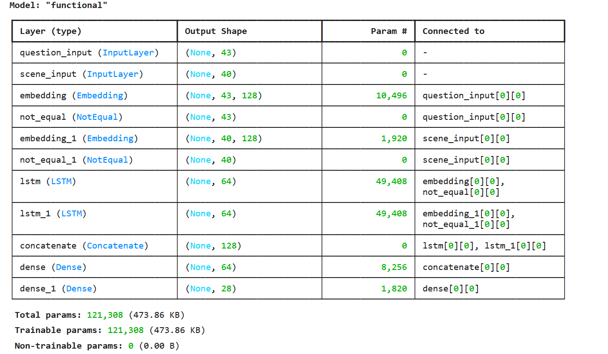
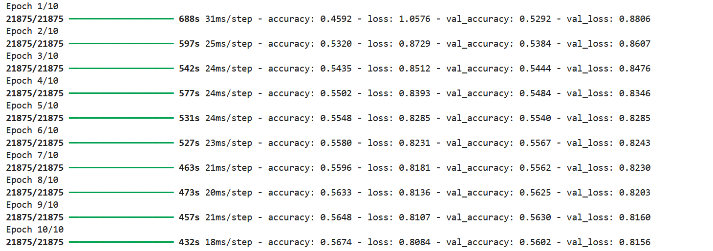
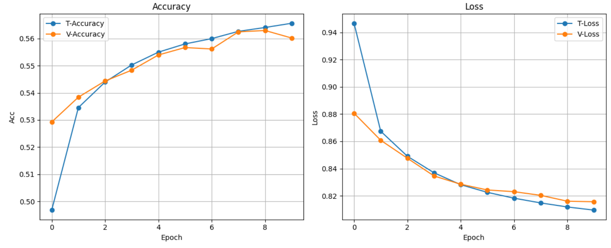

# ЯПИИ 2024
## lab01
#### Задачи:
- Установить tensorflow 2. Создать трансформерную сеть для определения местоположения объектов относительно друг друга.
- Сделать возможность сравнения (как в VQA) местоположения объектов друг с другом.
- Relational reasoning – датасет CLEVR.
- Зарегистрировать GitHub аккаунт
## Мерич Дорук Каймакджыоглу
## 1032245391 / НПМмд-01-24
Информация о наборе данных: Я использовал набор данных CLEVER версии 1.0 (без изображений) [CLEVR Download page](https://cs.stanford.edu/people/jcjohns/clevr/) <br>
1- Инициализация пакетов
```python 
import json
import numpy as np
import tensorflow as tf
import matplotlib.pyplot as plt
from sklearn.preprocessing import LabelEncoder
from tensorflow.keras.preprocessing.text import Tokenizer
from tensorflow.keras.preprocessing.sequence import pad_sequences
```
2- Обучающие и проверочные сцены и вопросы загружаются из файлов json.
```python 
with open('Desktop/scenes/CLEVR_train_scenes.json', 'r') as f:
    train_scenes = json.load(f)
with open('Desktop/questions/CLEVR_train_questions.json', 'r') as f:
    train_questions = json.load(f)
with open('Desktop/scenes/CLEVR_val_scenes.json', 'r') as f:
    val_scenes = json.load(f)
with open('Desktop/questions/CLEVR_val_questions.json', 'r') as f:
    val_questions = json.load(f)
```
3- Предварительная обработка данных
<br>
-- Для вопросов: Объединение вопросов, Инициализация токенизатора, Подгонка токенизатора, Преобразование в последовательности, заполнение последовательностей для получения однородного размера входных данных.
```python
all_questions = [q['question'] for q in train_questions['questions'] + val_questions['questions']]

question_tokenizer = Tokenizer(oov_token='<OOV>')
question_tokenizer.fit_on_texts(all_questions)

X_train_questions_seq = question_tokenizer.texts_to_sequences([q['question'] for q in train_questions['questions']])
X_val_questions_seq = question_tokenizer.texts_to_sequences([q['question'] for q in val_questions['questions']])

max_question_length = max(len(seq) for seq in X_train_questions_seq + X_val_questions_seq) # max len for padding.
X_train_questions_padded = pad_sequences(X_train_questions_seq, maxlen=max_question_length, padding='post')
X_val_questions_padded = pad_sequences(X_val_questions_seq, maxlen=max_question_length, padding='post')
```
-- Для сцен: Извлечение объектов из сцен, подготовка набора данных в функции, кодирование объектов сцены, дополнение объектов сцены для достижения максимальной длины сцены.
```python
def extract_features(scene):
    features = []
    for obj in scene['objects']:
        attributes = [obj['size'], obj['color'], obj['material'], obj['shape']] # size, color, shape etc...
        features.extend(attributes)
    return features

def prep_dataset(scenes, questions):
    X = []
    y = []
    s_dict = {scene['image_index']: scene for scene in scenes['scenes']} # dict for quick access.
    for question in questions['questions']:
        image_index = question['image_index']
        if image_index in s_dict:
            scene = s_dict[image_index] # corresponding scene
            features = extract_features(scene)
            X.append(features)
            y.append(question['answer'])
    return X, y

X_train_scenes_raw, y_train_raw = prep_dataset(train_scenes, train_questions)
X_val_scenes_raw, y_val_raw = prep_dataset(val_scenes, val_questions)

all_features = [item for sublist in X_train_scenes_raw + X_val_scenes_raw for item in sublist] # combining features of scenes 
scene_encoder = LabelEncoder() # labelencoder
scene_encoder.fit(all_features)

X_train_scenes_encoded = [scene_encoder.transform(features) for features in X_train_scenes_raw]
X_val_scenes_encoded = [scene_encoder.transform(features) for features in X_val_scenes_raw]

max_scene_length = max(len(seq) for seq in X_train_scenes_encoded + X_val_scenes_encoded) # max len for padding.
X_train_scenes_padded = pad_sequences(X_train_scenes_encoded, maxlen=max_scene_length, padding='post')
X_val_scenes_padded = pad_sequences(X_val_scenes_encoded, maxlen=max_scene_length, padding='post')
```
-- объединение всех слоев ответов и кодирование этих слоев.
```python
all_answers = y_train_raw + y_val_raw

label_encoder = LabelEncoder()
label_encoder.fit(all_answers)

y_train_encoded = label_encoder.transform(y_train_raw)
y_val_encoded = label_encoder.transform(y_val_raw)
```
4- Модель
<br>
-- Определение модели; с использованием входных слоев для вопросов и объектов сцены,
встраивание слоев для преобразования целочисленных последовательностей в плотные векторы,
инициализация слоев LSTM для обработки встраиваний для получения зависимостей,
объединение обоих слоев LSTM для объединения информации,
добавление плотного слоя с помощью ReLU,
выходного слоя с плотным слоем с активацией softmax,
наконец, определение модели, компиляция...
```python
q_input = tf.keras.layers.Input(shape=(max_question_length,), name='question_input')
q_embedding = tf.keras.layers.Embedding(
    input_dim=len(question_tokenizer.word_index) + 1,  # +1 for OOV (out of voc)
    output_dim=128, # dims
    mask_zero=True # mask
)(q_input)
question_lstm = tf.keras.layers.LSTM(64)(q_embedding) # lstm layer
s_input = tf.keras.layers.Input(shape=(max_scene_length,), name='scene_input')
s_embedding = tf.keras.layers.Embedding(
    input_dim=len(scene_encoder.classes_),
    output_dim=128,
    mask_zero=True
)(s_input)
scene_lstm = tf.keras.layers.LSTM(64)(s_embedding)

combined = tf.keras.layers.concatenate([question_lstm, scene_lstm])
fc1 = tf.keras.layers.Dense(64, activation='relu')(combined)
output = tf.keras.layers.Dense(len(label_encoder.classes_), activation='softmax')(fc1)
model = tf.keras.models.Model(inputs=[q_input, s_input], outputs=output)

model.compile(optimizer='adam', loss='sparse_categorical_crossentropy', metrics=['accuracy'])

model.summary()
```

<br>
5- обучение модели
```python
history = model.fit(
    {'question_input': X_train_questions_padded, 'scene_input': X_train_scenes_padded},
    y_train_encoded,
    epochs=10,
    batch_size=32,
    validation_data=(
        {'question_input': X_val_questions_padded, 'scene_input': X_val_scenes_padded},
        y_val_encoded
    )
)
```

6- Построение графика train & validation : accuracy & loss.
```python
plt.figure(figsize=(12, 5))

plt.subplot(1, 2, 1)
plt.plot(history.history['accuracy'], label='T-Accuracy', marker='o')
plt.plot(history.history['val_accuracy'], label='V-Accuracy', marker='o')
plt.title('Accuracy')
plt.xlabel('Epoch')
plt.ylabel('Acc')
plt.legend()
plt.grid(True)

plt.subplot(1, 2, 2)
plt.plot(history.history['loss'], label='T-Loss', marker='o')
plt.plot(history.history['val_loss'], label='V-Loss', marker='o')
plt.title('Loss')
plt.xlabel('Epoch')
plt.ylabel('Loss')
plt.legend()
plt.grid(True)

plt.tight_layout()
plt.show()
```

7- Визуализация прогнозов
```python
indices = np.random.choice(len(X_val_questions_padded), 5, replace=False)

test_questions = X_val_questions_padded[indices]
test_scenes = X_val_scenes_padded[indices]
test_labels = y_val_encoded[indices]

predict = model.predict({'question_input': test_questions, 'scene_input': test_scenes})
predicted = np.argmax(predict, axis=1)

for i, idx in enumerate(indices):
    question_text = val_questions['questions'][idx]['question'] # original question
    true_answer = label_encoder.inverse_transform([test_labels[i]])[0]
    pred_answer = label_encoder.inverse_transform([predicted[i]])[0]
    print(f"--------------------------------------------------------------------------\nQuestion: {question_text}\nTrue Answer: {true_answer}\nPredicted Answer: {pred_answer}\n--------------------------------------------------------------------------\n")
```

