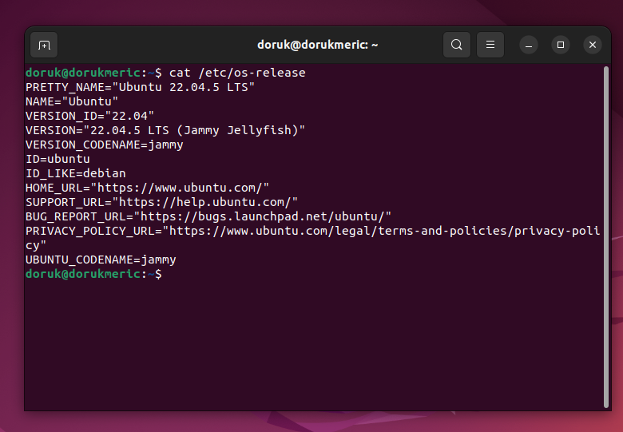
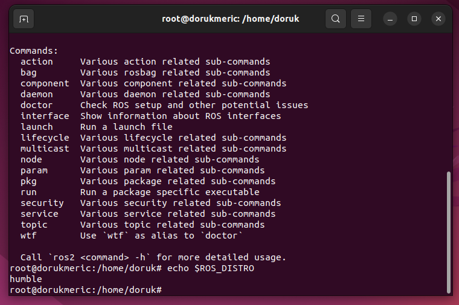
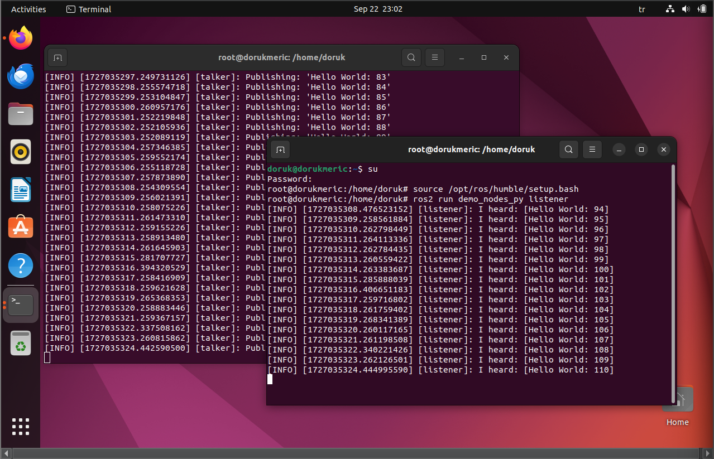
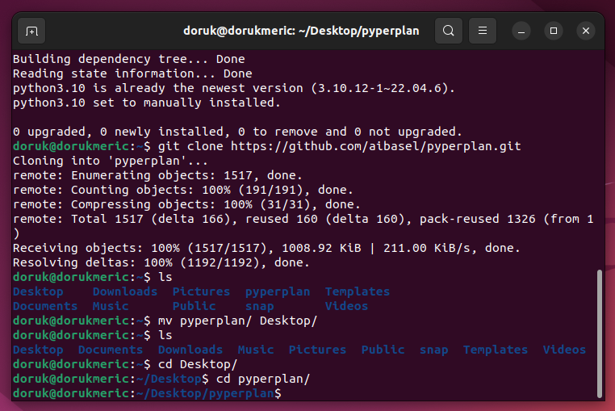
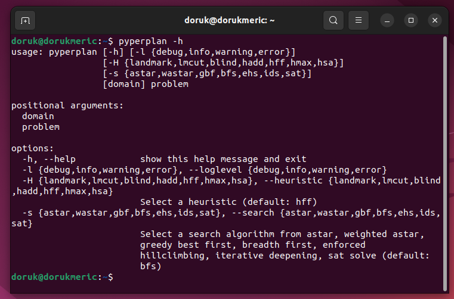
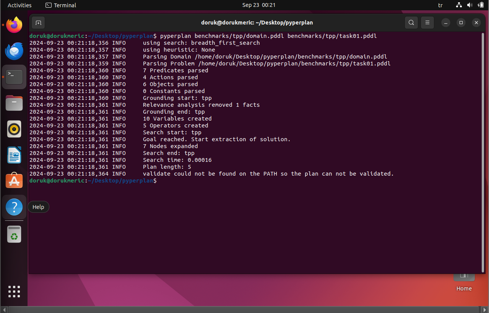
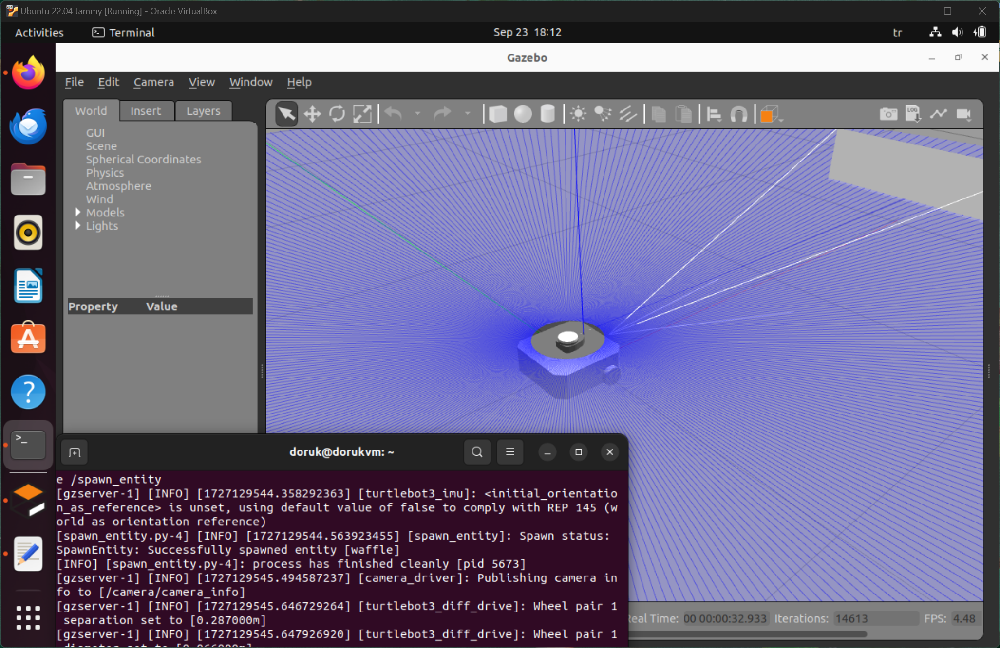
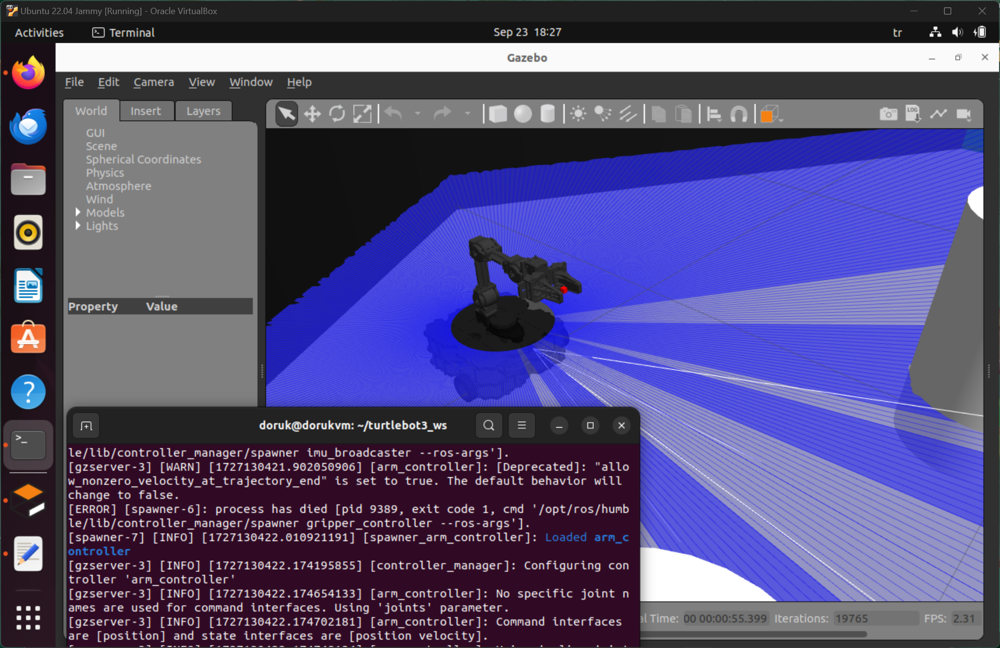
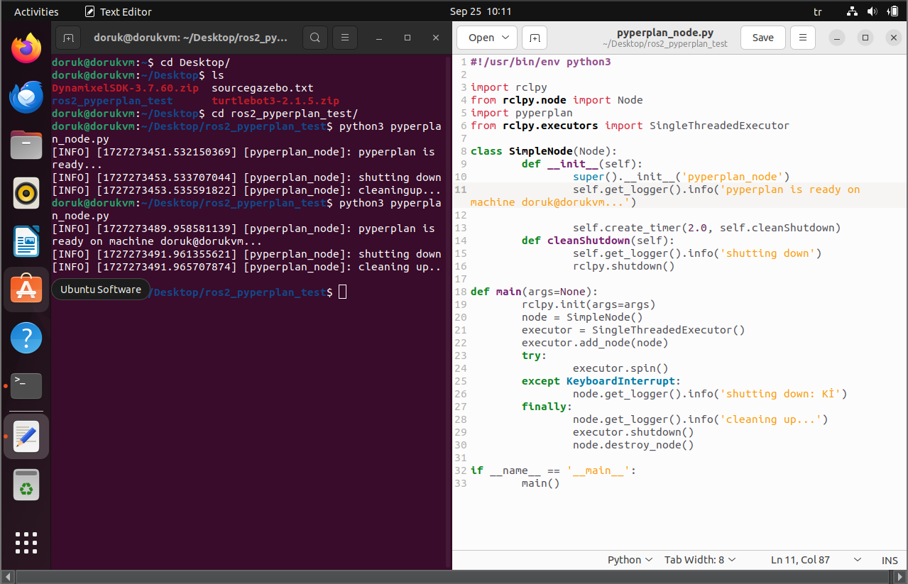

# ЯПИИ 2024
## lab02
#### Задачи:
- Установить ROS2 Humble
- Изучить планировщик Pyperplan [Pyperplan Github](https://github.com/aibasel/pyperplan)
- Построить модель среды с tb3 (4) с манипулятором, либо любой другой колесный робот с манипулятором [E-manual for tb3](https://emanual.robotis.com/docs/en/platform/turtlebot3/overview/)
- Создать ROS узел с планировщиком.
## Мерич Дорук Каймакджыоглу
## 1032245391 / НПМмд-01-24
### 1. Установить ROS2 Humble:
- Сначала я проверил инструкции на сайте ROS2 Humble. На странице «Начало работы» -> «Установка» я выбрал установку для Ubuntu 22.04 Jammy для виртуальной машины. https://releases.ubuntu.com/jammy/. и установил Ubuntu 22.04. <br>
<br>

<br>
- Следуя инструкциям на сайте ROS2 Humble, я успешно установил ROS2 Humble и проверил свою дистрибуцию ROS. <br>
<br>

<br>
- Также сделал тесты Talker и Listener. <br>
<br>

<br>

### 2. Изучить планировщик Pyperplan [Pyperplan Github](https://github.com/aibasel/pyperplan):
- Просматривая документацию по pyperplan, я клонировал его в свою виртуальную среду и установил зависимости. Либо просто выполните ```pip install pyperplan```. <br>
<br>

<br>
- Затем я посмотрел на флаги и структуру pyperplan, чтобы проверить, смогу ли я запустить тест внутри него. <br>
<br>

<br>
- Наконец, я провел тест, чтобы убедиться, что pyperplan работает, запустив домен и задачу. <br>
<br>

<br>

### 3- Построить модель среды с tb3 (4) с манипулятором, либо любой другой колесный робот с манипулятором [E-manual for tb3](https://emanual.robotis.com/docs/en/platform/turtlebot3/overview/)
- Я установил TurtleBot3 с его зависимостями и симуляциями из исходного кода, чтобы убедиться, что не будет никаких проблем. После завершения всех шагов в документации я запустил TurtleBot3 с моделью MODEL=waffle внутри Gazebo в пустом мире, чтобы убедиться, что после этого шага смогу просто запустить его с манипуляторной рукой. <br>
<br>

<br>
- Затем я установил зависимости для манипуляторной руки на TB3 Waffle и запустил её в среде машинного обучения.
<br>

<br>

### 4- Создать ROS узел с планировщиком.
- Прочитав несколько документаций в интернете, я создал базовый узел ROS2, который просто использует pyperplan без инструкций, чтобы показать, что pyperplan запускается, затем узел вращается и корректно завершает работу. <br>
<br>

<br>

```python
#!/usr/bin/env python3

import rclpy
from rclpy.node import Node
import pyperplan
from rclpy.executors import SingleThreadedExecutor

class SimpleNode(Node):
    def __init__(self):
        super().__init__('pyperplan_node')
        self.get_logger().info('pyperplan is ready on machine doruk@dorukvn...')
        self.create_timer(2.0, self.cleanShutdown)
    
    def cleanShutdown(self):
        self.get_logger().info('shutting down')
        rclpy.shutdown()

def main(args=None):
    rclpy.init(args=args)
    node = SimpleNode()
    executor = SingleThreadedExecutor()
    executor.add_node(node)
    try:
        executor.spin()
    except KeyboardInterrupt:
        node.get_logger().info('shutting down: Ki')
    finally:
        node.get_logger().info('cleaning up...')
        executor.shutdown()
        node.destroy_node()

if __name__ == '__main__':
    main()
```