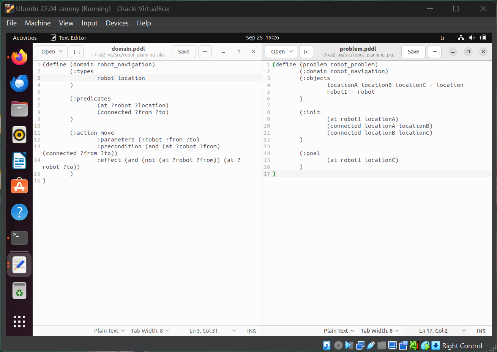
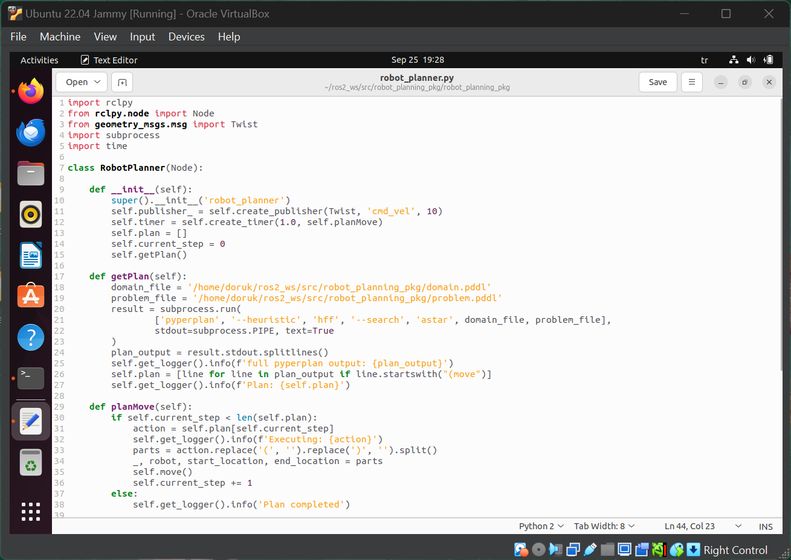
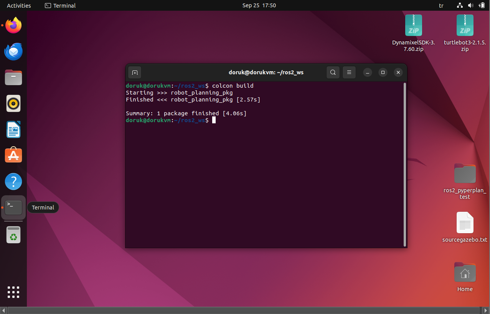

# ЯПИИ 2024
## lab03
#### Задачи:
- Использовать 1 из алгоритмов планирования для передвижения робототехнического агента из точки А в точку В
- Изучить отличие сплайнового метода построения пути от классических алгоритмов
## Мерич Дорук Каймакджыоглу
## 1032245391 / НПМмд-01-24
### 1. Использовать 1 из алгоритмов планирования для передвижения робототехнического агента из точки А в точку В

#### 1.a Выбранный алгоритм -> STRIPS:
- Сначала я спланировал задачу в формате, подходящем для планировщика STRIPS с использованием PDDL.
<br>

<br>

- Домен определяет общие правила и действия, которые будут выполняться в среде. В домене я определил действие перемещения, которое помогает роботу перемещаться между связанными местоположениями.
```
(define (domain robot_navigation)
	(:types
		robot location
	)
	
	(:predicates
		(at ?robot ?location)
		(connected ?from ?to)
	)

	(:action move
		:parameters (?robot ?from ?to)
		:precondition (and (at ?robot ?from) (connected ?from ?to))
		:effect (and (not (at ?robot ?from)) (at ?robot ?to))
	)
)
```
- Задача определяет начальное состояние и целевое состояние для робота. В задаче указаны конкретные местоположения 'A', 'B' и 'C', которые являются начальной позицией робота, мостом и целью.
```
(define (problem robot_problem)
	(:domain robot_navigation)
	(:objects
		locationA locationB locationC - location
		robot1 - robot
	)

	(:init
		(at robot1 locationA)
		(connected locationA locationB)
		(connected locationB locationC)
	)

	(:goal
		(at robot1 locationC)
	)
)
```
#### 1.b Использование Pyperplan для решения задачa STRIPS:
- Я передал файлы домена и задачи в [robot_planner.py]() Pyperplan для генерации плана, используя алгоритм поиска A* (astar) с эвристикой 'hff' для поиска среди действий и состояний. Таким образом, Pyperplan сгенерировал действия, которые робот мог бы выполнить для достижения цели. План -> [problem.pddl.soln]()
```
(move robot1 locationa locationb)
(move robot1 locationb locationc)
```
#### 1.c Создание узла и его выполнение:
- Я распарсил план, сгенерированный Pyperplan, и отправил команды в Gazebo. В [robot_planner.py]() выводы Pyperplan используются для извлечения отдельных действий 'move' и отправки их с помощью сообщений 'Twist' для передачи команд скорости роботу через топик ```/cmd_vel```.
- Ключевые части:
```python
def getPlan(self):
    	domain_file = '/home/doruk/ros2_ws/src/robot_planning_pkg/domain.pddl'
    	problem_file = '/home/doruk/ros2_ws/src/robot_planning_pkg/problem.pddl'
    	result = subprocess.run(
    		['pyperplan', '--heuristic', 'hff', '--search', 'astar', domain_file, problem_file],
    		stdout=subprocess.PIPE, text=True
    	)
    	plan_output = result.stdout.splitlines()
    	self.get_logger().info(f'full pyperplan output: {plan_output}')
    	self.plan = [line for line in plan_output if line.startswith("(move")]
    	self.get_logger().info(f'Plan: {self.plan}')

```
<br> Эта функция запускает Pyperplan для получения плана.
<br>

```python
def planMove(self):
        if self.current_step < len(self.plan):
            action = self.plan[self.current_step]
            self.get_logger().info(f'Executing: {action}')
            parts = action.replace('(', '').replace(')', '').split()
            _, robot, start_location, end_location = parts
            self.move()
            self.current_step += 1
        else:
            self.get_logger().info('Plan completed')
```
<br> Эта функция обрабатывает каждое действие из плана и отправляет команды скорости. <br>

```python
def move(self):
        msg = Twist()
        msg.linear.x = 0.5  # forward
        msg.angular.z = 0.0 # turn
        self.get_logger().info(f'Velocity command: {msg}')
        self.publisher_.publish(msg)  
        time.sleep(6)
        msg.linear.x = 0.0
        self.publisher_.publish(msg)
        self.get_logger().info(f'Robot stopped')
```
<br> Как следует из названия, эта функция отправляет сообщения роботу с помощью сообщений 'Twist'.
<br>

<br>

- Затем все было сохранено. Я настроил файл setup.py, выполнил ```Colcon build``` и активировал его с помощью команды source ```install/setup.bash```.
<br>

<br>

#### 1.d Запуск Gazebo, создание tb3_waffle и запуск ROS2-узла:
- 1. ```export TURTLEBOT3_MODEL=waffle``` 
- 2. ```ros2 launch turtlebot3_gazebo turtlebot3_world.launch.py``` 
- 3. ```ros2 run robot_planning_pkg robot_planner```
#### Gif verison:


#### İf gif doesnt work here is youtube and rutube:
<br>

[Youtube video of the robot going A to B](https://youtu.be/Q0oheLTBYhM)

<br>

[Rutube video of the robot going A to B](https://rutube.ru/video/private/ef14a17842831e43488df3dd346bab1a/?p=5cvLZwOHHACC49foZnITBw)

#### Code robot_planner:
```python
import rclpy
from rclpy.node import Node
from geometry_msgs.msg import Twist
import subprocess
import time

class RobotPlanner(Node):

    def __init__(self):
        super().__init__('robot_planner')
        self.publisher_ = self.create_publisher(Twist, 'cmd_vel', 10)
        self.timer = self.create_timer(1.0, self.planMove)
        self.plan = []
        self.current_step = 0
        self.getPlan()

    def getPlan(self):
    	domain_file = '/home/doruk/ros2_ws/src/robot_planning_pkg/domain.pddl'
    	problem_file = '/home/doruk/ros2_ws/src/robot_planning_pkg/problem.pddl'
    	result = subprocess.run(
    		['pyperplan', '--heuristic', 'hff', '--search', 'astar', domain_file, problem_file],
    		stdout=subprocess.PIPE, text=True
    	)
    	plan_output = result.stdout.splitlines()
    	self.get_logger().info(f'full pyperplan output: {plan_output}')
    	self.plan = [line for line in plan_output if line.startswith("(move")]
    	self.get_logger().info(f'Plan: {self.plan}')

    def planMove(self):
        if self.current_step < len(self.plan):
            action = self.plan[self.current_step]
            self.get_logger().info(f'Executing: {action}')
            parts = action.replace('(', '').replace(')', '').split()
            _, robot, start_location, end_location = parts
            self.move()
            self.current_step += 1
        else:
            self.get_logger().info('Plan completed')

    def move(self):
        msg = Twist()
        msg.linear.x = 0.5  # forward
        msg.angular.z = 0.0
        self.get_logger().info(f'Velocity command: {msg}')
        self.publisher_.publish(msg)  
        time.sleep(6)
        msg.linear.x = 0.0
        self.publisher_.publish(msg)
        self.get_logger().info(f'Robot stopped')

def main(args=None):
    rclpy.init(args=args)
    robot_planner = RobotPlanner()
    rclpy.spin(robot_planner)
    robot_planner.destroy_node()
    rclpy.shutdown()

if __name__ == '__main__':
    main()
```